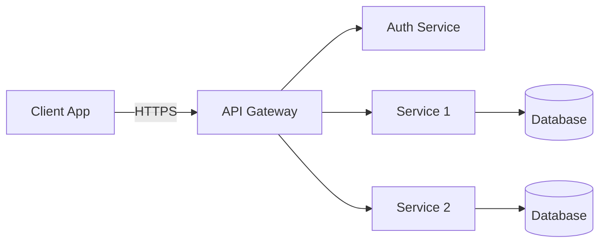
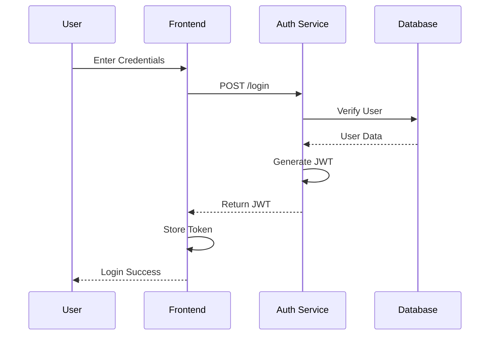
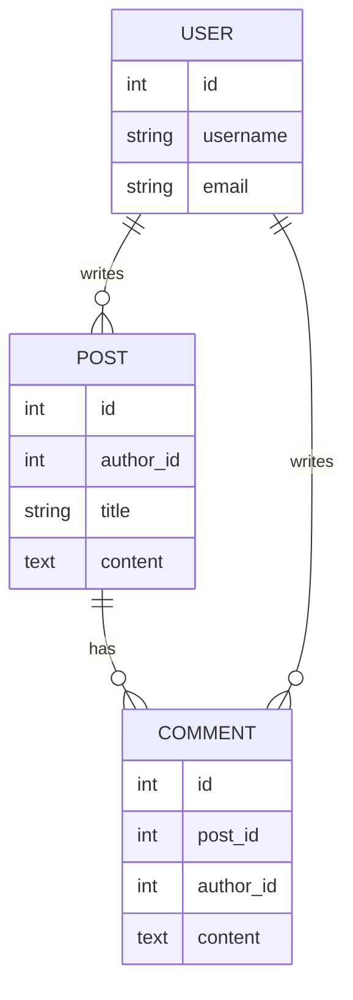

# Architecture Diagrams Instructions

**Last Updated**: 2025-11-09

This document provides guidance for creating architecture diagrams using Mermaid at the requirements stage of development.

## 🎯 Overview

Architecture diagrams visually communicate system design, component relationships, and data flow. Creating these diagrams early helps validate design decisions before implementation.

## 📋 Types of Architecture Diagrams

### System Architecture

High-level view of major components and their interactions

### Component Diagrams

Detailed view of individual components and their internal structure

### Sequence Diagrams

Show interactions over time between components

### Entity Relationship Diagrams (ERD)

Database schema and relationships

### Deployment Diagrams

How components are deployed across infrastructure

**TODO**: Add examples of each diagram type

## 🎨 Creating Diagrams with Mermaid

### Why Mermaid?

- **Text-based**: Version control friendly
- **Rendered in Markdown**: Works on GitHub, VSCode, etc.
- **No external tools**: Embedded directly in documentation
- **Maintainable**: Easy to update and diff

### Basic Mermaid Syntax

**TODO**: Add comprehensive Mermaid syntax guide

## 📐 Diagram Templates

### System Architecture Diagram

```markdown
# Architecture: {Feature Name}

**Requirement**: [REQ-XXX](../requirements/req-xxx.md)
**Specification**: [SPEC-XXX](../specifications/spec_xxx.md)
**Date**: YYYY-MM-DD
**Status**: Draft | Under Review | Approved

## Overview

[Describe the architecture and key design decisions]

## System Architecture

\`\`\`mermaid
graph TB
subgraph "Client Tier"
UI[User Interface]
end

    subgraph "Application Tier"
        API[API Server]
        Auth[Auth Service]
        BL[Business Logic]
    end

    subgraph "Data Tier"
        DB[(Database)]
        Cache[(Redis Cache)]
    end

    UI -->|HTTPS| API
    API --> Auth
    API --> BL
    BL --> DB
    BL --> Cache

\`\`\`

## Component Details

### API Server

- **Purpose**: Handle HTTP requests
- **Technology**: FastAPI / Flask / Django
- **Security**: See [codeguard-0-api-web-services.instructions.md](../codeguard-0-api-web-services.instructions.md)

[Add more components]

## Data Flow

\`\`\`mermaid
sequenceDiagram
participant User
participant API
participant Auth
participant DB

    User->>API: Request
    API->>Auth: Validate Token
    Auth-->>API: Token Valid
    API->>DB: Query Data
    DB-->>API: Return Data
    API-->>User: Response

\`\`\`

## References

- **Cross-Reference**: [SPEC-CROSS-REFERENCE.md](../SPEC-CROSS-REFERENCE.md)
- **Requirement**: [REQ-XXX](../requirements/req-xxx.md)
- **Threat Model**: [threat-model-{name}.md](threat-model-{name}.md)
```

**TODO**: Add more architecture diagram templates

### Sequence Diagram Template

```markdown
## Sequence: {Feature Name}

\`\`\`mermaid
sequenceDiagram
actor User
participant Frontend
participant Backend
participant Database

    User->>Frontend: Click Button
    Frontend->>Backend: POST /api/action
    Backend->>Database: INSERT data
    Database-->>Backend: Success
    Backend-->>Frontend: 200 OK
    Frontend-->>User: Show Success Message

\`\`\`
```

**TODO**: Add comprehensive sequence diagram examples

### Entity Relationship Diagram Template

```markdown
## Database Schema: {Feature Name}

\`\`\`mermaid
erDiagram
USER ||--o{ ORDER : places
USER {
int id PK
string email
string password_hash
datetime created_at
}
ORDER ||--|{ ORDER_ITEM : contains
ORDER {
int id PK
int user_id FK
datetime order_date
decimal total
}
ORDER_ITEM {
int id PK
int order_id FK
int product_id FK
int quantity
}
PRODUCT ||--o{ ORDER_ITEM : "ordered in"
PRODUCT {
int id PK
string name
decimal price
}
\`\`\`
```

**TODO**: Add ERD best practices and examples

### Component Diagram Template

```markdown
## Components: {Feature Name}

\`\`\`mermaid
graph LR
subgraph "Authentication Module"
Login[Login Handler]
JWT[JWT Manager]
Validator[Token Validator]
end

    subgraph "User Module"
        Profile[Profile Service]
        Settings[Settings Service]
    end

    Login --> JWT
    JWT --> Validator
    Profile --> Validator
    Settings --> Validator

\`\`\`
```

**TODO**: Add component diagram examples

## 📁 Output Location

Save architecture diagrams to `docs/diagrams/` with appropriate prefixes:

- System architecture: `architecture-{name}.md`
- Sequence diagrams: `sequence-{name}.md`
- ERD diagrams: `erd-{name}.md`
- Component diagrams: `component-{name}.md`
- Deployment diagrams: `deployment-{name}.md`

## ♻️ Diagram Versioning

**IMPORTANT**: When updating diagrams, create a duplicate file with the new changes rather than editing the original.

**Reasons:**

- Preserves history
- Better IDE compatibility (some IDEs don't render changes well)
- Avoids CLI-only edits that users might miss
- Easy rollback if needed

**Naming convention**:

```
architecture-{name}-v1.md
architecture-{name}-v2.md
architecture-{name}-v3.md
```

Or use dates:

```
architecture-{name}-2025-11-09.md
architecture-{name}-2025-12-15.md
```

**TODO**: Add versioning workflow and comparison guide

## 📝 Optional: Generate Separate .mmd Files

While Mermaid diagrams are embedded in Markdown, you can optionally export them to separate `.mmd` files for use with external tools.

**Example structure**:

```
docs/diagrams/
├── architecture-auth.md          # Markdown with embedded Mermaid
└── architecture-auth.mmd         # Separate Mermaid file (optional)
```

**TODO**: Add export script and usage guide

## 🔒 Security Considerations in Diagrams

When creating architecture diagrams, consider:

- Trust boundaries
- Authentication points
- Data encryption (in transit and at rest)
- API security
- Secret management

Reference relevant CodeGuard files:

- [codeguard-0-api-web-services.instructions.md](codeguard-0-api-web-services.instructions.md)
- [codeguard-0-authentication-mfa.instructions.md](codeguard-0-authentication-mfa.instructions.md)
- [codeguard-0-data-storage.instructions.md](codeguard-0-data-storage.instructions.md)

**TODO**: Add security annotation examples for diagrams

## 🤖 AI Assistant Integration

### For Claude Code

When generating architecture diagrams:

1. Reference requirement and specification documents
2. Use appropriate Mermaid diagram types
3. Include security annotations
4. Link relevant CodeGuard files
5. Save to `docs/diagrams/` with proper prefix
6. Update cross-reference table
7. Create versioned copies for updates (not in-place edits)

**TODO**: Add Claude-specific examples and prompts

### For GitHub Copilot

**TODO**: Add Copilot-specific examples

## ✅ Diagram Quality Checklist

- [ ] Diagram type appropriate for purpose
- [ ] All major components included
- [ ] Relationships clearly shown
- [ ] Security boundaries marked
- [ ] CodeGuard files referenced where relevant
- [ ] Linked to requirement/specification
- [ ] Proper file naming convention used
- [ ] Added to cross-reference table
- [ ] Rendered correctly in Markdown viewer

**TODO**: Expand checklist with specific criteria

## 📚 Mermaid Diagram Gallery

### Example: Simple API Architecture



### Example: Authentication Flow



### Example: Database Schema



**TODO**: Add more comprehensive diagram examples

## 📖 Mermaid Syntax Quick Reference

### Graph Directions

- `LR`: Left to Right
- `TB`: Top to Bottom
- `RL`: Right to Left
- `BT`: Bottom to Top

### Node Shapes

- `[Rectangle]`: `Node[Text]`
- `(Rounded)`: `Node(Text)`
- `{Diamond}`: `Node{Text}`
- `((Circle))`: `Node((Text))`
- `[(Database)]`: `Node[(Text)]`

### Connection Types

- `-->`: Solid arrow
- `-.->`: Dotted arrow
- `==>`: Thick arrow
- `--text-->`: Arrow with text

**TODO**: Add complete Mermaid syntax reference

## 🔗 Related Documentation

- [Master Workflow](master-workflow.md)
- [Threat Modeling](threat-modeling.instructions.md)
- [Requirements Template](../../docs/templates/requirements-template.md)
- [Specification Template](../../docs/templates/spec-template.md)

## 🌐 External Resources

- [Mermaid Official Documentation](https://mermaid.js.org/)
- [Mermaid Live Editor](https://mermaid.live/)
- [C4 Model for Architecture](https://c4model.com/)

---

**TODO**: This is a placeholder. Expand with:

- Complete Mermaid syntax guide
- Comprehensive diagram examples for common patterns
- Automation scripts for diagram generation
- Best practices for diagram maintenance
- Integration with documentation site (mkdocs)
