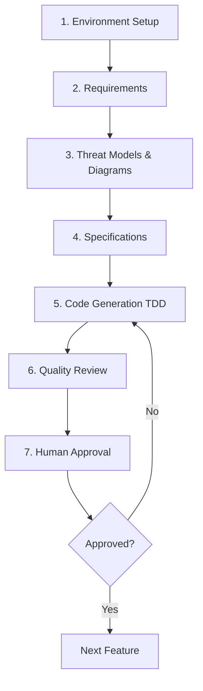

# Master Workflow: End-to-End Development Process

**Last Updated**: 2025-11-09

This document outlines the complete development workflow for projects using this template, from initial requirements through deployment.

## 🎯 Workflow Overview



## Stage 1: Environment Setup

### Check/Create UV Virtual Environment

See [uv-environment-setup.instructions.md](uv-environment-setup.instructions.md) for detailed instructions.

**Key steps:**

1. Check for existing uv virtual environment
2. Create if not found: `uv venv`
3. Activate environment
4. Install/add packages: `uv add <package>` (NOT `uv pip install`)

**TODO**: Expand with specific commands and troubleshooting

## Stage 2: Requirements Creation

### Creating a New Requirement

1. Use the template: `docs/templates/requirements-template.md`
2. Create new file: `docs/requirements/req-{name}.md`
3. Clearly define:
   - Problem statement
   - Acceptance criteria
   - Dependencies
   - Security considerations

**TODO**: Add examples and best practices

## Stage 3: Threat Models & Architecture Diagrams

### Generate Threat Models

See [threat-modeling.instructions.md](threat-modeling.instructions.md)

Options:

- Per-requirement threat models
- High-level aggregate (all requirements)
- Grouped by feature/module

**Output**: `docs/diagrams/threat-model-{name}.md`

### Generate Architecture Diagrams

See [architecture-diagrams.instructions.md](architecture-diagrams.instructions.md)

**Output**: `docs/diagrams/architecture-{name}.md`

**Important**: When updating diagrams, create duplicate files with new changes (preserves original for IDE compatibility)

**TODO**: Add Mermaid examples and diagram versioning strategy

## Stage 4: Specification Generation

### From Requirements to Specifications

1. Use template: `docs/templates/spec-template.md`
2. Create: `docs/specifications/spec_{name}.md`
3. Include:
   - Technical approach
   - Architecture decisions
   - Security considerations (reference CodeGuard rules)
   - Implementation plan

### Auto-update Documentation

When specs are created/modified:

- Update `docs/INDEX.md`
- Update `docs/SPEC-CROSS-REFERENCE.md`
- Update folder READMEs

See [automation-setup.instructions.md](automation-setup.instructions.md)

**Human Review & Approval Required**

**TODO**: Add specification quality checklist

## Stage 5: Code Generation with TDD

### Test-Driven Development (RED-GREEN-REFACTOR)

See [tdd-workflow.instructions.md](tdd-workflow.instructions.md)

**Process:**

1. **RED**: Write failing unit tests first
2. **GREEN**: Write minimal code to make tests pass
3. **REFACTOR**: Improve code while keeping tests green

### Security Integration

**Automatically apply CodeGuard rules:**

- Reference ALL relevant `codeguard-*.instructions.md` files
- Weight relevance based on spec content:
  - Auth features → `codeguard-0-authentication-mfa.instructions.md`
  - API features → `codeguard-0-api-web-services.instructions.md`
  - Database → `codeguard-0-data-storage.instructions.md`
  - etc.

### Follow Project Standards

- **Docstrings**: Follow `docs/rules/docstring-standards.md`
- **Output Format**: Follow `docs/rules/output-format.md`
- **Test Structure**: Mirror `src/` structure in `test/`
- **Test Naming**: `test_{module_name}.py`

### Execution Logging

All code generation should log:

- CodeGuard rules applied
- Guidelines followed
- Issues encountered
- Resolutions applied

**Output**: `docs/output-logs/{timestamp}-code-generation.md`

**TODO**: Add TDD examples and CodeGuard integration details

## Stage 6: Quality Review

### Automated Checks

1. **Ruff**: Linting and formatting

   ```bash
   ruff check src/ test/
   ruff format src/ test/
   ```

2. **Pytest**: Run all tests

   ```bash
   pytest -v
   ```

3. **Coverage**: Ensure adequate test coverage
   ```bash
   pytest --cov=src --cov-report=html
   ```

### Security Review

See [security-review.instructions.md](security-review.instructions.md)

**TODO**: Add security checklist

### Post-Test Review

See [post-test-review.instructions.md](post-test-review.instructions.md)

**TODO**: Add quality metrics and acceptance criteria

### Auto-update Error KB

When code self-fixes errors during development:

- Log to `docs/rules/error-resolution-kb.md`
- Include error pattern and solution
- Reference for future issues

## Stage 7: Human Approval

### Review Checklist

- [ ] All tests pass
- [ ] Ruff checks pass
- [ ] Security review complete
- [ ] Documentation updated
- [ ] Cross-reference table updated
- [ ] CodeGuard compliance verified
- [ ] Error KB updated (if applicable)

**Approved** → Proceed to next feature or deployment
**Rejected** → Return to Stage 5 with feedback

## 🔄 Continuous Improvement

### Documentation Maintenance

Keep synchronized:

- `docs/INDEX.md` - Master index
- `docs/SPEC-CROSS-REFERENCE.md` - Implementation tracking
- `docs/requirements/` - Requirements docs
- `docs/specifications/` - Spec docs
- Docstrings in code
- READMEs in folders

### Historical Records

Document major decisions in `docs/history/`

## 🤖 AI Assistant Integration

This workflow works with:

- **Claude Code**: See [claude-usage.instructions.md](claude-usage.instructions.md)
- **GitHub Copilot**: See [copilot-usage.instructions.md](copilot-usage.instructions.md)

Both assistants can:

- Follow this workflow automatically
- Apply CodeGuard security rules
- Generate code using TDD
- Update documentation
- Log execution details

## 📚 Related Documentation

- [TDD Workflow](tdd-workflow.instructions.md)
- [UV Environment Setup](uv-environment-setup.instructions.md)
- [Threat Modeling](threat-modeling.instructions.md)
- [Architecture Diagrams](architecture-diagrams.instructions.md)
- [Automation Setup](automation-setup.instructions.md)

---

**TODO**: This is a foundational document. Expand each section with:

- Detailed step-by-step instructions
- Examples and code snippets
- Troubleshooting guides
- Best practices
- Common pitfalls to avoid
