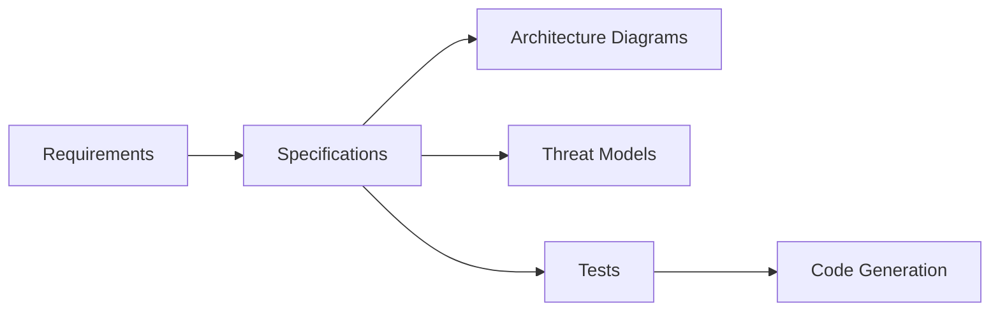

# Documentation Master Index

**Last Updated**: 2025-11-10

This is the central hub for all project documentation. This index is automatically maintained as requirements, specifications, and code evolve.

## Quick Links

- [Specification Cross-Reference Table](SPEC-CROSS-REFERENCE.md) - Track relationships between requirements, specs, code, tests, and diagrams
- [Requirements](requirements/) - Project requirements and feature requests
- [Specifications](specifications/) - Technical specifications derived from requirements
- [Diagrams](diagrams/) - Architecture diagrams, threat models, and other visual documentation
- [Rules](rules/) - Project standards and conventions
- [History](history/) - Decision logs and conversation history
- [Templates](templates/) - Templates for creating new documentation

## Documentation Workflow

This diagram shows how different documentation artifacts flow from requirements through to implementation.

### Text Description: Documentation Flow

**Primary Flow:**

1. **Requirements** → Define what needs to be built
2. **Specifications** → Technical details of how to build it (includes architecture decisions, data flows, integrations)
3. **Architecture Diagrams** → Visual representations created FROM specifications
4. **Threat Models** → Security risk analysis based on specifications and diagrams
5. **Tests** → Test Drive Development (TDD) basically has tests first. Always follow TDD best practices but ensure it is human understandable and pythonic.
6. **Code Generation** → Implementation based on specifications

**Key Insight**: Diagrams and threat models are created AFTER specifications because they require knowing the system architecture, data flows, and technical approach.

**Relationships:**

- Requirements are the starting point for all work
- Specifications serve as the central hub, linking to both implementation (code/tests) and documentation (diagrams/threat models)
- Diagrams and threat models support understanding and security
- Code and tests validate the specification

### Mermaid Diagram: Documentation Flow

<details>
<summary>📊 View Mermaid Diagram Code</summary>



</details>

### ASCII Diagram: Documentation Flow

```
         ┌──────────────┐
         │ Requirements │
         └──────┬───────┘
                │
                ↓
         ┌──────────────────────────────────────────────────┐
         │         Specifications                           │
         │ (includes architecture, data flows, integrations)│
         └──────┬───────────────────────────────────────────┘
                │
                ├──────────────────┬─────────────────┐
                │                  │                 │
                ↓                  ↓                 ↓
         ┌─────────────┐    ┌──────────┐      ┌──────────┐
         │Architecture │    │  Tests   │      │  Code    │
         │  Diagrams   │    │  (TDD)   │      │Generation│
         └──────┬──────┘    └────┬─────┘      └────▲─────┘
                │                │                 │
                │                └─────────────────┘
                │
                ↓
         ┌──────────────┐
         │Threat Models │◄───── (requires Spec + Architecture)
         │   (STRIDE)   │
         └──────────────┘
```

### Detailed Flow Explanation

This documentation workflow ensures traceability and completeness:

- **Requirements as foundation**: Everything starts with clear, documented requirements that define the problem and acceptance criteria
- **Specifications as bridge**: Technical specifications translate requirements into actionable plans with architecture decisions, data flows, and security considerations
- **Architecture diagrams**: Created FROM specifications to visualize system design
- **Threat models**: Created using specifications and diagrams to identify security risks based on actual system architecture
- **Code implementation**: Specifications guide code generation using TDD methodology
- **Test validation**: Tests verify that code meets specification requirements
- **Visual documentation**: Architecture diagrams provide high-level understanding of system design
- **Security analysis**: Threat models identify and document security risks and mitigations

All documents are cross-referenced in [SPEC-CROSS-REFERENCE.md](SPEC-CROSS-REFERENCE.md) to maintain traceability throughout the development lifecycle.

See [.github/instructions/master-workflow.md](../.github/instructions/master-workflow.md) for detailed workflow documentation.

### Workflow Prompts

- [Requirements → Specification Workflow](../.github/prompts/workflow-requirements-to-spec.prompt.md) - Complete orchestration
- [Specification → Code Workflow](../.github/prompts/workflow-spec-to-code.prompt.md) - TDD implementation with reviews
- [All Prompts](../.github/prompts/) - Individual operation prompts

### Quality Gates

- [Quality Checklists](../.github/instructions/quality-checklists.md) - Definition of Done for each stage

## Folder Structure

### Requirements (`requirements/`)

Source of truth for what needs to be built. Each requirement document should:

- Clearly state the problem or need
- Define acceptance criteria
- Link to related specifications

### Specifications (`specifications/`)

Technical specifications generated from requirements. Each spec should:

- Reference the originating requirement(s)
- Define technical approach and architecture
- Include security considerations (CodeGuard compliance)
- Link to implementation files and tests

### Diagrams (`diagrams/`)

Visual documentation including:

- `architecture-*.md` - System architecture diagrams
- `threat-model-*.md` - Threat model diagrams
- `sequence-*.md` - Sequence diagrams
- `erd-*.md` - Entity relationship diagrams
- Other diagram types as needed

All diagrams use Mermaid format embedded in Markdown.

### Rules (`rules/`)

Project-specific standards and conventions:

- [Docstring Standards](rules/docstring-standards.md)
- [Markdown Standards](rules/markdown-standards.md)
- [Output Format Specifications](rules/output-format.md)
- [Error Resolution KB](rules/error-resolution-kb.md)

### History (`history/`)

Decision logs and important conversations that shaped the project. Each entry should be dated and capture the context of major decisions.

Key history files:

- [Setup Conversation](history/2025-11-09-setup-conversation.md) - How this template was created
- [Workflow Usage Guide](history/2025-11-09-workflow-usage-guide.md) - Practical examples and step-by-step instructions

### Templates (`templates/`)

Starting point templates for creating new documentation:

- [Requirements Template](templates/requirements-template.md)
- [Specification Template](templates/spec-template.md)

## Using This Documentation System

### For Humans

1. Start with requirements - clearly define what you need
2. Review or generate specifications from requirements
3. Use the cross-reference table to track implementation progress
4. Follow the master workflow for the complete development process

### For AI Assistants (Claude Code / GitHub Copilot)

- See [.github/instructions/claude-usage.instructions.md](../.github/instructions/claude-usage.instructions.md)
- See [.github/instructions/copilot-usage.instructions.md](../.github/instructions/copilot-usage.instructions.md)

## Maintenance

This index and all cross-references should be updated:

- When new requirements are added
- When specifications are created or modified
- When code is generated or changed
- When diagrams are created or updated

See automation options in [.github/instructions/](../.github/instructions/) for keeping documentation synchronized.
